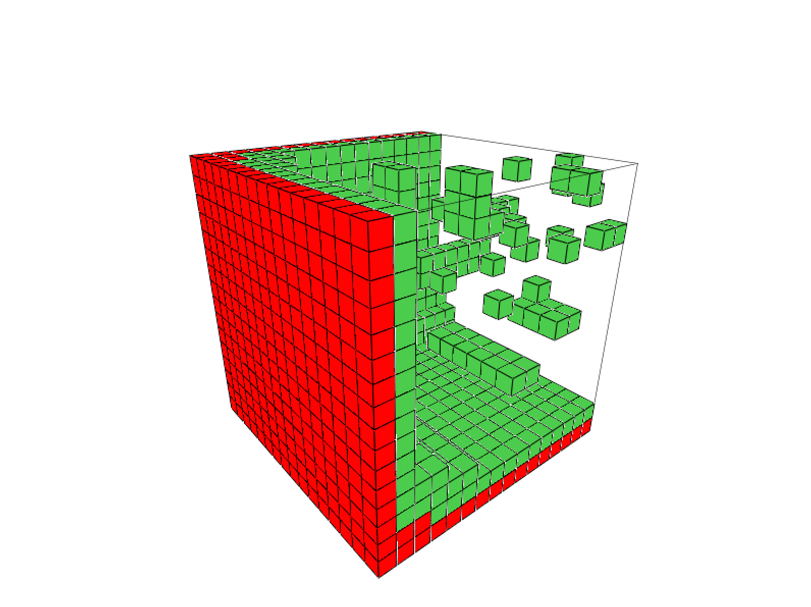
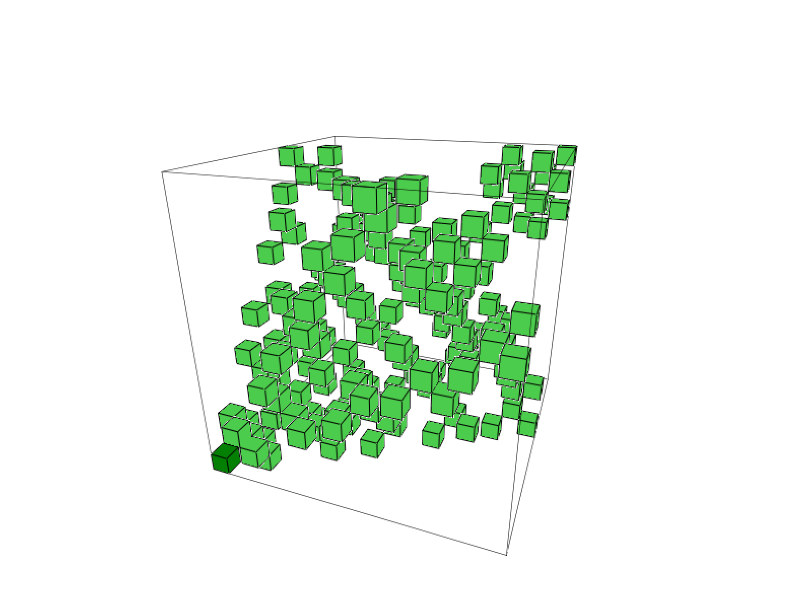
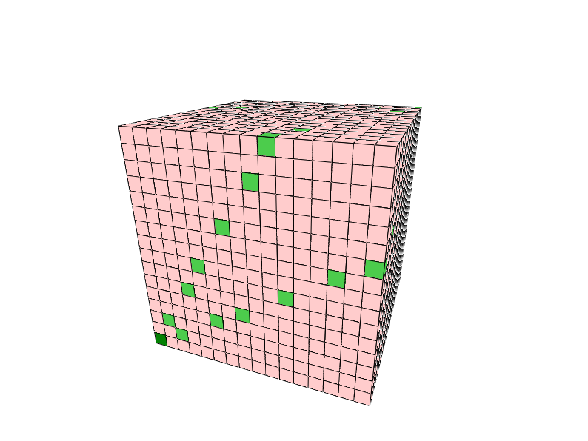

# cubes

## Rules
Alice and Bob are playing a game on a n by n chessboard. Initially, there is a piece somewhere
on the board. Each turn they have a choice of moving it in one of the directions specified by 
the initial set of rules. The goal is to either get to the lower left corner (that it, you win 
if you  can't make a move), or to avoid getting there (you lose if you can't make a move).

## Install

    mkdir build
    cd build && cmake ..
    make

## Run

    ./cubes file

*file* defines the rules of the game. Examples can be found in the examples/ directory.

## Examples

    NOMOVES = WIN
    MOVE -1 0 0 LIM -1  
    MOVE 0 -1 0 LIM -1  
    MOVE 0 0 -1 LIM -1

This means that the player which can't make any move wins, and three moves are possible: 
(-1, 0, 0), (0, -1, 0) and (0, 0, -1). In each one of these directions we can hop 
by any amount of steps ("LIM -1").

    NOMOVES = LOSE  
    MOVE -1 -2 -3 LIM -1  
    MOVE -3 -1 -2 LIM -1  
    MOVE -2 -3 -1 LIM -1

    NOMOVES = WIN  
    MOVE -1 0 0 LIM -1  
    MOVE 0 -1 0 LIM -1  
    MOVE 0 0 -1 LIM -1  
    MOVE -1 -1 0 LIM -1  
    MOVE 0 -1 -1 LIM -1  
    MOVE -1 0 -1 LIM -1

And with losing squares shown:

